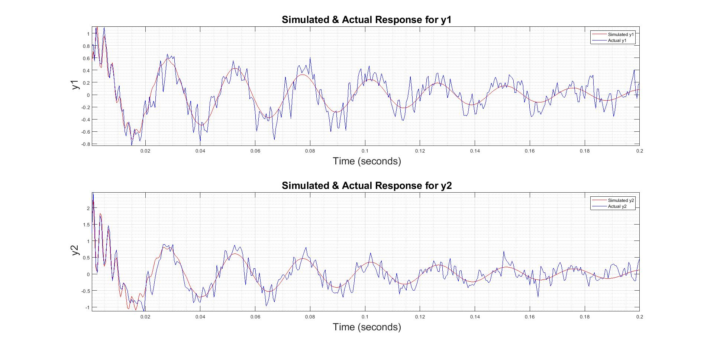
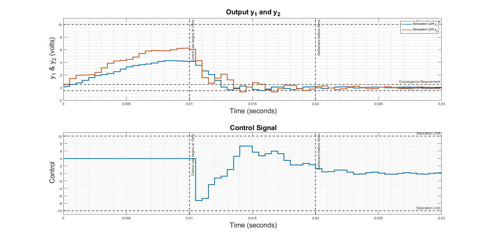
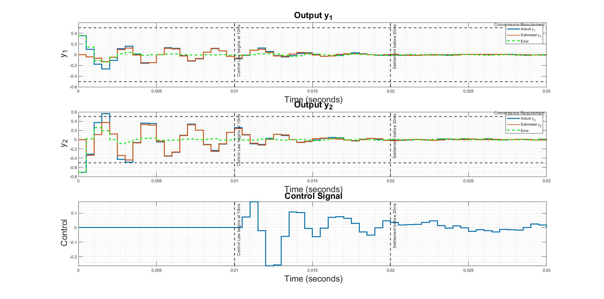

# <div align="center">Applied-Linear-Controls-Project-Part-2</div>
**<div align="center">To develop an [output feedback controller](http://www.cds.caltech.edu/~murray/books/AM08/pdf/am06-outputfbk_16Sep06.pdf) and demonstrate regulation of states and outputs using the dynamic system from the Project Part 1. </div>**

> **Note**: The first step for developing a state feedback or an output feedback controller is to develop a state-space model of the open loop plant, which is done in the Project Part 1.

#### How to Access the Unknown Plant function in the script:
```Matlab
  [y, u, xhat] = s20_plant(dt_ofc, time)
```

#### Tasks List:
- [x] Executing the appropriate code based on the sequential objectives below
- [x] Finding appropriate LQR gains such that the 2 output responses converge and pass all the Mandatory Performance Requirements
- [x] Finding appropriate [Kalman Filter](https://www.intechopen.com/books/introduction-and-implementations-of-the-kalman-filter/introduction-to-kalman-filter-and-its-applications) Gains such that the Discrete time Output feedback controller converges the actual response and estimated response signals converge and pass all the Mandatory Performance Requirements

#### Objectives Achieved: 

- Generated a pulse excitation signal with a magnitude of 10V and applied to both the unknown plant and the reduced order model from Project Part 1 to plot the output response signals
- Tested the Discrete State-Space Model from Project Part 1 for controllability and observability using `ctrb()` and `obsv()` functions
- Designed an LQR state feedback controller using `lqr()` function to generate a closed-loop time response
> **Note**: Since we have discrete time state space model, we use `stairs()` function to plot our digitally spaced data
- Estimated the state vector by designing the appropriate Kalman state feedback gain using `kalman()` function
- Constructed the discrete time state space output feedback controller LTI object `dt_ofc` and inputed into the s20_plant.p file using the above stated call structure to generate the closed loop response for the output feedback controller
- Compared the estimated output response and the actual output response 

### <div align="center">*Comparison b/w Actual response (using actual unknown plant) and simulated response (using reduced model from Project part 1) when excited with same pulse excitation of 10V*</div>
<p align="center"> </p>

### <div align="center">*Closed Loop time response using LQR state feedback control*</div>
<p align="center"> </p>

### <div align="center">*Final Comparison between estimated output and actual output*</div>
<p align="center"> </p>


#### Languages Used:
- Matlab
- Latex 

#### Use of each file:
- [**Final_Project_Sethi.mlx**](Final_Project_Sethi.mlx) - Executable file with learly defined problem statement and approach
- [**Final_Project_Sethi.pdf**](Final_Project_Sethi.pdf) - Published Document for a quick check of Solutions and Code
- [**s20_plant.p**](s20_plant.p) - Unknown Plant function file that takes discrete time State-Space LTI object and time as total duration og simulation and returns the output response y(2xN), control signal response u(1XN) and estimated state response xhat(NS X N) where N is the number of samples of data collected and NS is the number of states in our open loop discrete-time model.
